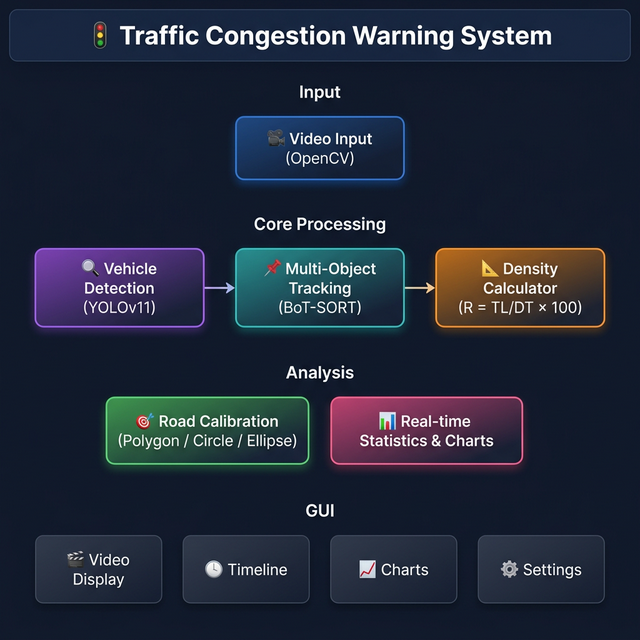

# 🚦 Traffic Congestion Warning System

> **Hệ Thống Cảnh Báo Ùn Tắc Giao Thông** — Ứng dụng giám sát giao thông thời gian thực sử dụng thị giác máy tính và học sâu.


---

## 📋 Mục Lục

- [Giới Thiệu](#-giới-thiệu)
- [Tính Năng](#-tính-năng)
- [Kiến Trúc Hệ Thống](#-kiến-trúc-hệ-thống)
- [Công Thức Tính Mật Độ](#-công-thức-tính-mật-độ)
- [Yêu Cầu Hệ Thống](#-yêu-cầu-hệ-thống)
- [Cài Đặt](#-cài-đặt)
- [Hướng Dẫn Sử Dụng](#-hướng-dẫn-sử-dụng)
- [Cấu Trúc Dự Án](#-cấu-trúc-dự-án)
- [Cấu Hình](#-cấu-hình)
- [Công Nghệ Sử Dụng](#-công-nghệ-sử-dụng)
- [Tác Giả](#-tác-giả)
- [Giấy Phép](#-giấy-phép)

---

## 📖 Giới Thiệu

Hệ thống **Cảnh Báo Ùn Tắc Giao Thông** là một ứng dụng desktop được xây dựng bằng Python, sử dụng mô hình **YOLOv11** để nhận diện phương tiện và thuật toán **BoT-SORT** để theo dõi đa đối tượng. Hệ thống tính toán mật độ giao thông dựa trên diện tích chiếm dụng thực tế của các phương tiện theo tiêu chuẩn kích thước phương tiện Việt Nam, từ đó đưa ra cảnh báo mức độ ùn tắc theo thời gian thực.

### Ứng dụng chính:
- Giám sát mật độ giao thông từ video camera
- Cảnh báo ùn tắc theo 3 mức: **Thấp** (xanh lá), **Trung bình** (vàng), **Cao** (đỏ)
- Đếm và phân loại phương tiện: xe máy, xe đạp, ô tô, xe buýt, xe tải
- Hỗ trợ hiệu chỉnh vùng quan sát với nhiều chế độ (polygon, circle, ellipse)

---

## ✨ Tính Năng

### 🎥 Xử Lý Video
- Phát video từ file hoặc camera
- Xử lý video đa luồng (multi-threaded) cho hiệu suất cao
- Timeline seek, play/pause/stop
- Hỗ trợ nhiều định dạng video (MP4, AVI, MKV, ...)

### 🔍 Phát Hiện & Theo Dõi Phương Tiện
- **YOLOv11** với batch processing cho phát hiện phương tiện
- **BoT-SORT** tracker tích hợp sẵn trong YOLO để theo dõi liên tục
- Phát hiện 5 loại phương tiện: xe máy, xe đạp, ô tô, xe buýt, xe tải
- Hỗ trợ Re-Identification (ReID) cho tracking chính xác hơn

### 📊 Thống Kê & Biểu Đồ
- Biểu đồ mật độ giao thông theo thời gian thực
- Biểu đồ số lượng phương tiện theo loại
- Đồng hồ đo mật độ (density gauge) trực quan
- Thống kê theo từng làn đường

### 🎯 Hiệu Chỉnh Vùng Quan Sát (Calibration)
- **Polygon mode**: Chấm 4 điểm định nghĩa vùng quan sát
- **Circle mode**: Vùng tròn cho nút giao thông (roundabout)
- **Ellipse mode**: Vùng elip cho các nút giao hình oval
- Hỗ trợ nhiều làn đường (multi-lane)
- Lưu/tải profile hiệu chỉnh

### 🎨 Giao Diện
- Giao diện PyQt6 hiện đại
- Hỗ trợ **Dark mode** và **Light mode**
- Responsive layout
- Dashboard chọn video kiểu camera giám sát

### ⚙️ Cấu Hình Linh Hoạt
- Tùy chỉnh tham số model (confidence, IoU threshold, image size)
- Tùy chỉnh tham số tracker (track buffer, match threshold, GMC method)
- Cấu hình hiệu chỉnh (kích thước đường, perspective transform)
- Lưu/tải cấu hình từ file JSON

### 📈 Benchmark & Đánh Giá
- Đo lường FPS, thời gian detection, tracking
- So sánh kết quả giữa các lần benchmark
- Đánh giá độ chính xác với Precision, Recall, mAP, IoU
- Xuất kết quả benchmark ra file JSON

---

## 🏗️ Kiến Trúc Hệ Thống

<p align="center">
  
</p>


---

## 📐 Công Thức Tính Mật Độ

Mật độ giao thông được tính dựa trên tỷ lệ diện tích chiếm dụng:

### Công thức chính

$$R = \frac{TL}{DT} \times 100 \quad (\%)$$

Trong đó:
- **R**: Tỷ lệ mật độ giao thông (%)
- **TL**: Tổng diện tích chiếm dụng = $\sum (X_i \times SL_i)$ (m²)
- **DT**: Diện tích vùng đường = $L_s \times W_s$ (m²)
- $X_i$: Diện tích mặt bằng phương tiện loại $i$ (dài × rộng)
- $SL_i$: Số lượng phương tiện loại $i$

### Kích thước phương tiện (Tiêu chuẩn Việt Nam)

| Phương tiện | Dài (m) | Rộng (m) | Cao (m) | Diện tích mặt bằng (m²) |
|:-----------:|:-------:|:--------:|:-------:|:------------------------:|
| 🏍️ Xe máy    | 2.05    | 0.725    | 1.102   | 1.486                    |
| 🚲 Xe đạp    | 1.75    | 0.600    | 1.050   | 1.050                    |
| 🚗 Ô tô      | 5.80    | 2.100    | 1.300   | 12.180                   |
| 🚌 Xe buýt   | 12.10   | 2.600    | 4.100   | 31.460                   |
| 🚛 Xe tải    | 9.10    | 2.600    | 4.100   | 23.660                   |

### Mức độ ùn tắc

| Mức độ | Giá trị R | Trạng thái | Màu |
|:------:|:---------:|:----------:|:---:|
| 🟢 Thấp | < 30% | Giao thông thưa | Xanh lá |
| 🟡 Trung bình | 30% – 80% | Giao thông vừa phải | Vàng |
| 🔴 Cao | ≥ 80% | Giao thông đông đúc | Đỏ |

---

## 💻 Yêu Cầu Hệ Thống

### Phần cứng tối thiểu
- **CPU**: Intel Core i5 hoặc AMD Ryzen 5 trở lên
- **RAM**: 8 GB
- **Ổ cứng**: 2 GB trống
- **GPU** *(khuyến nghị)*: NVIDIA GPU hỗ trợ CUDA (GTX 1060 trở lên)

### Phần mềm
- **Hệ điều hành**: Windows 10/11, Linux, macOS
- **Python**: 3.8 trở lên
- **CUDA** *(tùy chọn)*: 11.8+ (cho tăng tốc GPU)

---

## 🚀 Cài Đặt

### 1. Clone repository

```bash
git clone https://github.com/KunN-21/Traffic-Congestion-Warning-System.git
cd Traffic-Congestion-Warning-System
```

### 2. Tạo môi trường ảo (khuyến nghị)

```bash
python -m venv venv

# Windows
venv\Scripts\activate

# Linux/macOS
source venv/bin/activate
```

### 3. Cài đặt dependencies

```bash
pip install -r requirements.txt
```

### 4. Cài đặt PyTorch với CUDA (tùy chọn, cho GPU)

Truy cập [https://pytorch.org/](https://pytorch.org/) để chọn phiên bản phù hợp. Ví dụ:

```bash
# CUDA 11.8
pip install torch torchvision --index-url https://download.pytorch.org/whl/cu118

# CUDA 12.1
pip install torch torchvision --index-url https://download.pytorch.org/whl/cu121
```

### 5. Chuẩn bị model YOLO

Đặt file model YOLOv11 đã huấn luyện (`best_v2.pt`) vào thư mục `Model/`:

```
SourceCode/
├── Model/
│   └── best_v2.pt    ← File model YOLO
├── Video/
│   └── *.mp4          ← Các file video để phân tích
├── main_app.py
└── ...
```

### 6. Chạy ứng dụng

```bash
python main_app.py
```

---

## 📖 Hướng Dẫn Sử Dụng

### Bước 1: Chọn Video
- Khi mở ứng dụng, màn hình **Dashboard** sẽ hiển thị các video có sẵn trong thư mục `Video/`
- Click vào một video để chọn, hoặc nhấn **"Mở File"** để duyệt tìm file video

### Bước 2: Hiệu Chỉnh Vùng Quan Sát (Calibration)
1. Nhấn nút **"Hiệu Chỉnh"** trên thanh công cụ
2. Chọn chế độ hiệu chỉnh: **Polygon**, **Circle**, hoặc **Ellipse**
3. Chọn số làn đường (1–4)
4. Chấm các điểm trên video để xác định vùng quan sát
5. Nhập kích thước thực tế: chiều dài ($L_s$) và chiều rộng ($W_s$) của đoạn đường (mét)
6. Hệ thống tự động tính diện tích $DT = L_s \times W_s$

### Bước 3: Bắt Đầu Phân Tích
- Nhấn nút **▶ Play** để bắt đầu phát video và phân tích
- Hệ thống sẽ tự động phát hiện, theo dõi phương tiện và tính mật độ
- Kết quả hiển thị trên biểu đồ và bảng thống kê ở panel bên phải

### Bước 4: Xem Kết Quả
- **Tab Thống kê**: Xem số lượng phương tiện theo từng loại, theo từng làn
- **Tab Cấu hình**: Xem thông tin hệ thống, tham số hiệu chỉnh, mức mật độ
- **Biểu đồ**: Chọn xem biểu đồ mật độ hoặc số lượng phương tiện
- **Đồng hồ đo**: Xem mức mật độ hiện tại trực quan

---

## 📁 Cấu Trúc Dự Án

```
SourceCode/
│
├── main_app.py                          # Entry point chính của ứng dụng
├── requirements.txt                     # Danh sách dependencies
├── README.md                            # Tài liệu dự án
│
├── Model/                               # Thư mục chứa model YOLO
│   └── best_v2.pt                       # Model YOLOv11 đã huấn luyện
│
├── Video/                               # Thư mục chứa video đầu vào
│
├── TrafficMonitoringSystem/             # Package chính
│   ├── __init__.py                      # Package init & documentation
│   │
│   ├── core/                            # Module xử lý lõi
│   │   ├── __init__.py
│   │   ├── detector.py                  # Phát hiện phương tiện (YOLOv11)
│   │   ├── tracker.py                   # Theo dõi phương tiện (BoT-SORT)
│   │   ├── calibration.py               # Hiệu chỉnh vùng quan sát
│   │   ├── density_calculator.py        # Tính mật độ giao thông
│   │   └── video_thread.py              # Xử lý video đa luồng
│   │
│   ├── ui/                              # Module giao diện người dùng
│   │   ├── __init__.py
│   │   ├── main_window.py               # Cửa sổ chính
│   │   ├── video_widget.py              # Widget hiển thị video
│   │   ├── video_selector.py            # Dashboard chọn video
│   │   ├── chart_widget.py              # Biểu đồ thời gian thực
│   │   ├── timeline_widget.py           # Timeline & seek bar
│   │   ├── config_dialog.py             # Dialog cấu hình hệ thống
│   │   └── calibration_widget.py        # Widget hướng dẫn hiệu chỉnh
│   │
│   ├── config/                          # Cấu hình hệ thống
│   │   ├── __init__.py
│   │   ├── settings.py                  # Quản lý cấu hình
│   │   ├── default_config.json          # Cấu hình mặc định
│   │   └── trackers/
│   │       └── botsort_custom.yaml      # Cấu hình BoT-SORT
│   │
│   └── utils/                           # Tiện ích
│       ├── __init__.py
│       ├── logger.py                    # Hệ thống logging
│       ├── paths.py                     # Xử lý đường dẫn (cross-platform)
│       └── benchmark.py                 # Công cụ benchmark & đánh giá
│
├── logs/                                # Log files (tự động tạo)
└── calibration_profiles/                # Profile hiệu chỉnh (tự động tạo)
```

---

## ⚙️ Cấu Hình

### Cấu hình mặc định (`default_config.json`)

```json
{
  "model": {
    "model_path": "Model/best_v2.pt",
    "conf_threshold": 0.45,
    "iou_threshold": 0.5,
    "imgsz": 640,
    "max_det": 100
  },
  "tracker": {
    "tracker_type": "botsort",
    "track_buffer": 45,
    "match_thresh": 0.7,
    "with_reid": true
  },
  "calibration": {
    "default_road_length": 50.0,
    "default_road_width": 10.0,
    "use_perspective_transform": true
  }
}
```

### Tùy chỉnh trong ứng dụng

Mở **Menu → Cấu hình hệ thống** hoặc tab **Cấu hình** trên giao diện để thay đổi:

| Tham số | Mô tả | Mặc định |
|---------|--------|----------|
| `conf_threshold` | Ngưỡng confidence phát hiện | 0.45 |
| `iou_threshold` | Ngưỡng IoU cho NMS | 0.5 |
| `imgsz` | Kích thước ảnh đầu vào model | 640 |
| `track_buffer` | Số frame giữ track khi mất đối tượng | 45 |
| `match_thresh` | Ngưỡng matching cho tracking | 0.7 |
| `with_reid` | Bật/tắt Re-Identification | true |

---

## 🛠️ Công Nghệ Sử Dụng

| Công nghệ | Phiên bản | Mục đích |
|:----------:|:---------:|:--------:|
| **Python** | 3.8+ | Ngôn ngữ chính |
| **PyQt6** | ≥ 6.6.0 | Giao diện đồ họa (GUI) |
| **Ultralytics** | ≥ 8.0.0 | YOLOv11 + BoT-SORT tracking |
| **PyTorch** | ≥ 2.0.0 | Deep Learning framework |
| **OpenCV** | ≥ 4.8.0 | Xử lý ảnh và video |
| **NumPy** | ≥ 1.24.0 | Tính toán số học |
| **dataclasses-json** | ≥ 0.6.0 | Serialization dữ liệu |

---

## 🧩 Mô Tả Module

### Core Modules

| Module | Mô tả |
|--------|--------|
| `detector.py` | Phát hiện phương tiện sử dụng YOLOv11 với hỗ trợ batch processing và GPU acceleration |
| `tracker.py` | Theo dõi phương tiện qua các frame sử dụng BoT-SORT (tích hợp sẵn trong YOLO) |
| `calibration.py` | Quản lý hiệu chỉnh vùng quan sát – hỗ trợ polygon, circle, ellipse và multi-lane |
| `density_calculator.py` | Tính mật độ giao thông theo công thức $R = (TL/DT) \times 100$ |
| `video_thread.py` | Xử lý video trong thread riêng biệt, sử dụng queue cho playback mượt mà |

### UI Modules

| Module | Mô tả |
|--------|--------|
| `main_window.py` | Cửa sổ chính tích hợp tất cả thành phần UI |
| `video_widget.py` | Hiển thị video với overlay phát hiện, hiệu chỉnh vùng |
| `video_selector.py` | Dashboard kiểu camera giám sát để chọn video |
| `chart_widget.py` | Biểu đồ đường thời gian thực cho mật độ và số lượng phương tiện |
| `timeline_widget.py` | Thanh timeline với seek bar và điều khiển phát lại |
| `config_dialog.py` | Dialog cấu hình với các tab: Model, Tracker, Calibration, Video |

---

## 👥 Tác Giả

Dự án được phát triển bởi nhóm sinh viên:

<table>
  <tr>
    <td align="center">
      <a href="https://github.com/KunN-21">
        <br />
        <sub><b>KunN-21</b></sub>
      </a>
    </td>
    <td align="center">
      <a href="https://github.com/TruongDucHuy193">
        <br />
        <sub><b>TruongDucHuy193</b></sub>
      </a>
    </td>
    <td align="center">
      <a href="https://github.com/Nimiii0411">
        <br />
        <sub><b>Nimiii0411</b></sub>
      </a>
    </td>
  </tr>
</table>

---

## 📄 Giấy Phép

Dự án được phát triển cho mục đích học tập và nghiên cứu.

---

<p align="center">
  <b>🚦 Traffic Congestion Warning System</b><br>
  <i>Hệ Thống Cảnh Báo Ùn Tắc Giao Thông</i><br>
  <sub>Built with ❤️ using Python, YOLOv11, BoT-SORT & PyQt6</sub>
</p>